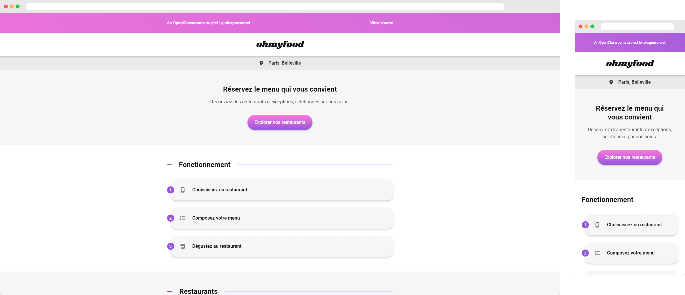

# OhMyFood



## Overview

### The Project

The project is to create a website prototype for OhMyFood by integrating the HTML and CSS model and making it dynamic with CSS animations and transitions.

### User Story

- [x] the integration must be done only in HTML5 and CSS3, no frameworks must be used.
- [x] The HTML must be validate by W3C.
- [x] The CSS must be validate by W3C.
- [x] The website must be responsive.
- [x] The integration must be done in mobile first.
- [x] The prototype must be compatible with the latest versions of Google Chrome and Mozilla Firefox.

### Technology Stack

- **Authorized**: HTML / CSS / Sass
- **Recommended**: HTML / Sass
- **Prohibited**: JavaScript / Framework CSS / Inline CSS

### Style Guide

#### Colors

The colors are: `#9356DC`, `#FF79DA`, `#99E2D0`

#### Font

The font is:

- [Shrikhand](https://fonts.google.com/specimen/Shrikhand) for the headings.
- [Roboto](https://fonts.google.com/specimen/Roboto) for body.

## Local Development

1. Clone the repository

```sh
git clone https://github.com/alexperronnet/openclassrooms-p3-ohmyfood.git
```

2. Navigate to the repository

```sh
cd openclassrooms-p3-ohmyfood
```

3. Install dependencies

```sh
npm install
```

4. Start the development server

```sh
npm run dev
```

5. Genrate production build

```sh
npm run build
```

6. Preview the production

```sh
npm run preview
```

---

See the [live URL](https://alexperronnet.github.io/openclassrooms-p3-ohmyfood/)
